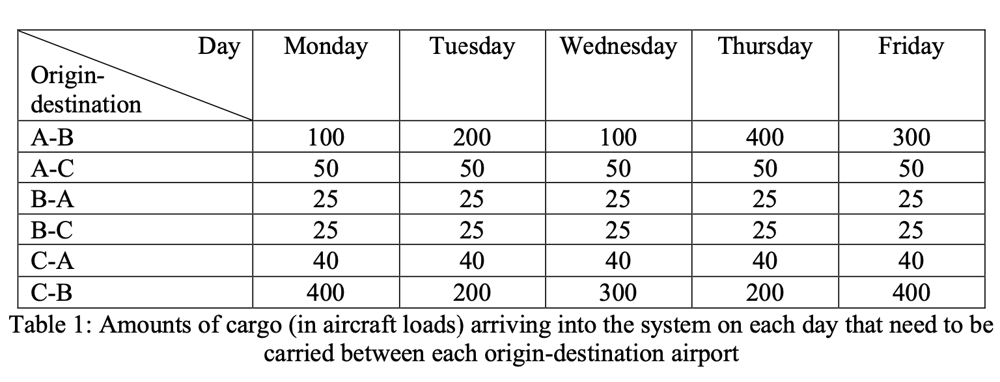
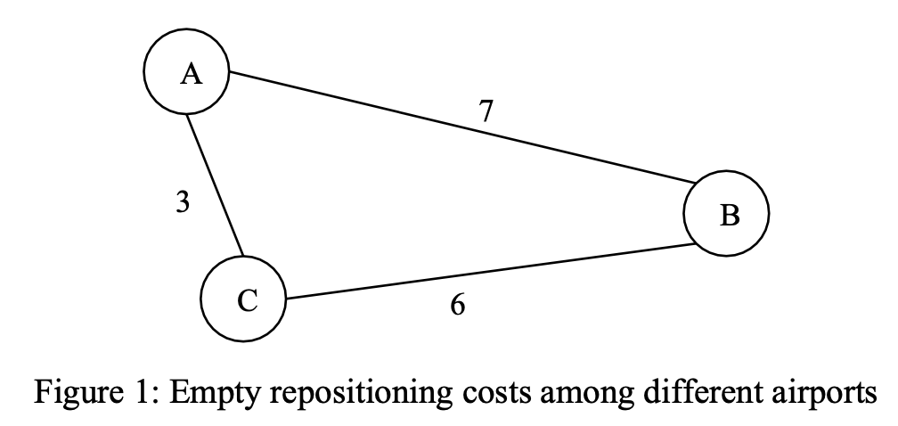

# CS5727-Optimization-Methods-Cornell-Tech
This repository contains the code and report for the coursework of CS5727 Optimization Methods offered in Fall 2022 at Cornell Tech. This is the work of NAMAN MAKKAR and AYA CHEHABI

## Project Overview
This coursework works on a Dynamic Driver Assignment Problem with the help of Gurobi in python to optimize the cargo operations of Express Air. 
According to the problem description, Express Air is a cargo delivery business that operates between three airports, A, B, and C.
They have a fleet of 1200 aircraft, for transporting cargo. Their system receives new cargoes to be delivered between these airports every weekday.

The students were provided with a cyclic scheduling problem where they had to take into account the amount of cargo not delivered the previous day, the cargo entering the system daily, the number of aircraft available at the airport on a given day in addition to the number of aircraft repositionings required to balance the flow of inbound and outbound cargo at each airport.
With the objective to minimize the overall costs of aircraft repositionings as well as the costs of holding the cargo in the warehouses.

## Data
The given cost of holding cargo in the warehouse is 10 units per day

The cost of repositioning a single empty aircraft from A to B and B to A is given as 7 units while the same between A and C is given as 3 units and between C and B is 6 units

The amount of cargo entering the system daily is provided in the table below

